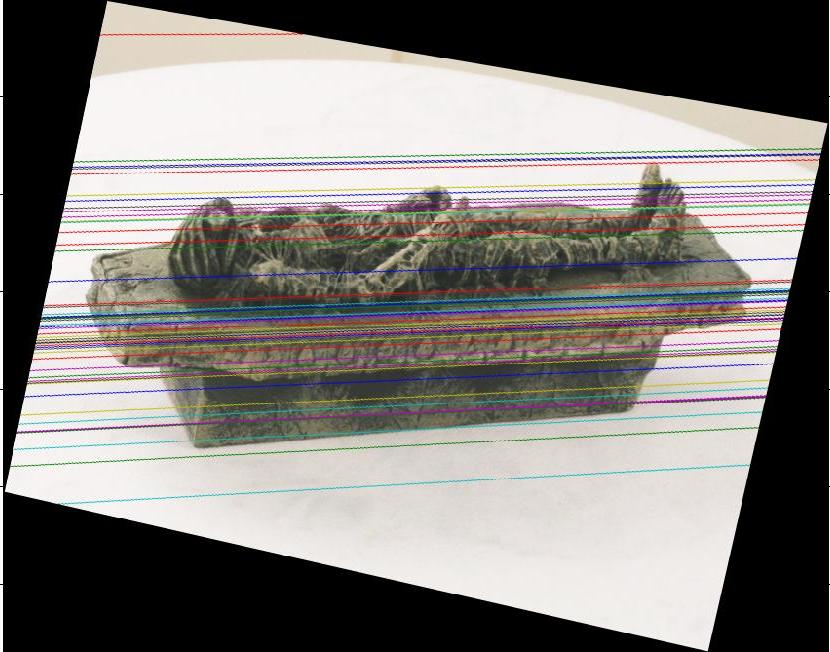
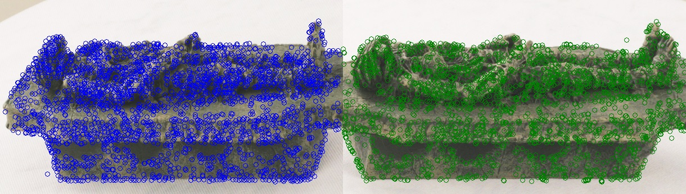

# Sparse-3D-Reconstruction
A sample project to do sparse 3D reconstruction of pair images. 
This project contains all steps of 3D reconstruction. These steps are listed below: 
1 - Computing Fundamental matrix using SIFT and RANSAC 
2 - Image Rectification 
3 - Dense matching using block matcing 
4 - sparse 3D reconstruction using projection matrix 
5 - Outlier removal 
6 - creating mesh for point cloud 

# Usage:
% run all steps 
ACV_prj1()

# Visual Results:

